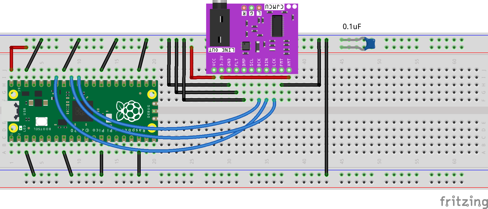

# arduino-pico-music_box

## Arduino Music Box for RP2040

Port of "[Sophie's Music Box](https://www.craigandheather.net/celemusicbox.html)" that is also based on [elm-chan](http://elm-chan.org/works/mxb/report.html)'s music box.

There is a similar PIC32's implementation of this one: [Markus Gritsch's Music Box](http://dangerousprototypes.com/forum/index.php?topic=3472.0). I have chosen the "Sophie's Music Box" due to it being more simpler in the implementation, and the PIC32's music box didn't sound very well too during the porting stage.

The midi is from [Markus Gritsch's Music Box](http://dangerousprototypes.com/forum/index.php?topic=3472.0).

## Features
- Music box delight!
- Play files inside the flash using LittleFS!

## Requirements
- Arduino IDE 2.3.2 and above
- Raspberry Pi RP2040 board library (4.1.1)
- [Modified MajicDesigns' MD_MIDIFile library](https://github.com/nyh-workshop/MD_MIDIFile) to play MIDI files from LittleFS (Flash size: 128KB)
- [arduino-littlefs-upload](https://github.com/earlephilhower/arduino-littlefs-upload) extension

Using MajicDesigns' MIDI parser with LittleFS support instead of MidiTones.

## Build a circuit example (Default: BCLK=31, WS=32, DATA=34)

## Installation and usage instructions

- Unzip the MIDI parser into the Arduino's `Documents\Arduino\Libraries folder`.
- Install the arduino-littlefs-upload extension into the `C:\Users\<username>\.arduinoIDE\plugins\`.
- At the `Tools->Flash Size` select `Sketch:3968KB,FS:128KB` before compiling.
A sample midi file is there inside for testing.

## How to copy the files into the flash
- Put the midi file into the sketch folder's Data folder. Make sure you have the same midi file name in that .ino too (SMF.load)!
- Get the Raspberry Pico to be in Boot mode.
- Ctrl-Shift-P in the Arduino IDE -> Upload LittleFS to.... Your midi files are now saved into the flash! :D
- Reset the Raspberry Pico and let the music play!

## Issues
- A bit too soft! Might add some minor amplification?
- Could be improved to use interpolators?
- Some MIDI files might not play properly in the system and it is currently being investigated too.